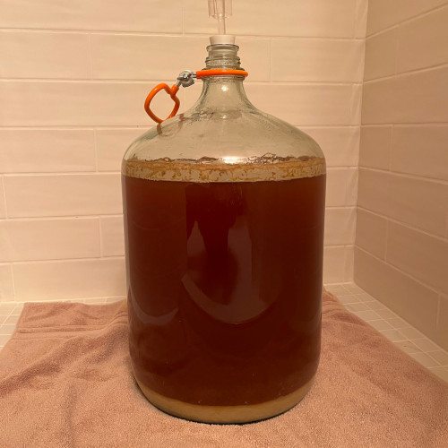

# German Altbier-1

Altbier is usually a dark, copper color. It is fermented at a moderate temperature using a top-fermenting yeast--which gives its flavour some fruitiness. Because Altbier is then matured at a cooler temperature, its flavour is more akin to lager beer styles than is the norm for top-fermented beers (such as British pale ale).

## Ingredients

- 6 lb Golden light DME [malt]
- 1 lb pilsen light DME [malt]
- 3/4 lb Munich Malt I [specialty grains]
- 1/4 lb Crystal 40°L [specialty grains]
- 4 oz Fuggle hops (1oz boil / 3oz flameout) [hops]
- 1 pk Imperial Dieter [yeast]

## Instructions

1. add 7 gal water and all [specialty grains] in a bag and bring up to boil
2. (0 minutes) turn off burner, add all [malt] and 1 oz boil [hops] in a bag, restart burner
3. (60 minutes) turn off burner, add 3 oz flameout [hops]
4. chill to 70F
5. transfer to 6 gal primary fermentor and aerate
6. direct pitch [yeast] (no starter required)
7. install brew-lock
8. ferment for 2 weeks (60-67F)
9. transfer to keg and cold lager (35-39F) for 2 weeks
10. carbonate and drink

## Notes
* 2/1/2024: brewed, no yeast started required as top fermenting ale yeast took off nicely
